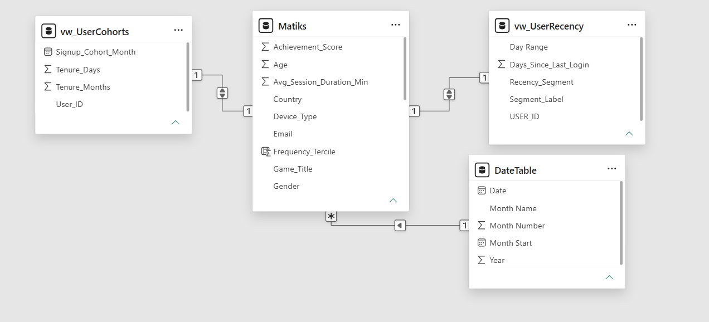

# Matiks - User Behaviour & Revenue Analysis

## Overview
A data analysis project for a gaming platform. The task: analyse user-level behavioural and revenue data to identify what's working, what's not, and where the opportunities lie - then present it through an interactive dashboard and a short insights report.

Matiks provided a 10,000-user dataset covering signup activity, device and platform usage, session behaviour, subscription tier, and revenue. The goal was to:

* Build an interactive dashboard tracking core usage and revenue metrics, with breakdowns by device, segment, and game mode
* Identify behavioural patterns, early signs of churn, and characteristics of high-value users
* Turn the findings into clear, actionable recommendations for the business

### Tools Used
SQL Server, Power BI, DAX and Power Query

### Repository Contents

| File | Description |
|---|---|
| `Matiks_Dataset.csv` | Raw 10,000-user dataset provided by Matiks |
| `Matiks.sql` | SQL script covering table setup, cohort logic, recency/churn segmentation, high-value user segmentation, and funnel tracking |
| `Matiks.pbix` | Power BI dashboard file |
| `Matiks_Question.md` | Dashboard page-by-page spec derived from the brief |

### Data Model
Data Model

The model is built around a central `Matiks` table holding user demographics, behaviour, and revenue fields, joined 1-to-1 on User_ID to `vw_UserCohorts` (signup cohort and tenure) and `vw_UserRecency` (days since last login and recency segment). A separate `DateTable` connects to `Matiks` in a many-to-one relationship to support time intelligence across the dashboard.

### Assumptions

1. This is a user-level snapshot and an event log. Each row represents one user with lifetime totals; there is no daily active table. This means true DAU/MAU/WAU, which are built from a repeated login table. So, last login recency was used as a proxy.  A user is counted as "active" in a given window if the most recent recorded login falls within it. This also affects churn rate; we can't find a churn rate for periods longer than 30 days.
2. Revenue trend over time cannot be determined because the Total_Revenue_USD represent lifetime revenue per user rather than total revenue recorded at specific points in time; hence, Revenue trend by sign-up month was used to identify the cohort that gave the highest revenue.

### Dashboard

The Power BI dashboard is organised into 5 pages:

1. Overview: KPI cards (Users, Revenue, ARPU, ARPPU, Churn Rate, Conversion Rate), revenue by cohort, signup trend, revenue split by tier
2. Breakdowns:  revenue by device, game mode, game title, subscription tier, and country.
3. Behavioural Patterns: session and duration distributions, sessions-vs-revenue scatter, revenue by rank tier
4. Churn & Retention: recency segment KPIs, days-since-login distribution, churn rate by device/tier/referral source, at-risk high-value user table
5. High-Value Users & Cohorts: top revenue decile profile, frequency-vs-revenue quadrant, revenue by referral source

https://github.com/user-attachments/assets/e2bdb418-bf60-475f-9271-8d1b4975eefa

### Insights

1. Free-tier users spend at most as much as paid subscribers. ARPU is $50.57 for free, $50.42 for silver, $50.37 for platinum and $49.36 for gold. A roughly $1 spread across all four tiers. If tier actually reflected spending power or intent, you'd expect a ladder: Free < Silver < Gold < Platinum. Instead, it's flat, and Gold is actually the lowest of the four. This shows the subscription tier isn't functioning the way it ought to function.
2. Using recency (days since last login), almost half of the users are showing meaningful disagreement. 50.1%. of the users have not logged in for 15+ days, which shows a retention error.
3. Recency (days since last login) does not predict revenue or activity. Inactive users for 22- 30 days have, on average, $49.48 in revenue and 20 sessions, nearly identical to users active in the last 7 days ($53.32 revenue and 19 sessions)
4. Churn rate and revenue are flat across device type, subscription tier, and referral source. This tells us that churn rate and revenue are not driven by any of them. So, whatever is causing users to go quiet or revenue to go up is independent of the platform, plan or how they found the product.
5. Revenue shows almost  no relationship to engagement. correlation between total revenue and total sessions is -0.02. i.e., heavy users and light users spend about the same on average.

### Recommendation

1. Run a target upsell campaign for free-tier users. They have shown willingness to spend like paid users.
2. Collect transaction-level purchase data since device type, subscription tier, referral source and game mode don't explain who spends more; understanding high-value users will require details on what they buy and at what price point.
3. Playtime alone does not explain monetisation. Matiks should investigate the specific products' behaviour and experience associated with higher-value spending rather than assuming more engagement automatically produced more revenue.
4. Recency (days since last login) won't reliably identify who is actually at risk of leaving before they stop being valuable, because last login is a single snapshot, not a login history. To build a real warning system, Matiks need a session (login event data), not a one-time last-seen date.
5. Since revenue is almost even across device type, game mode, and game title, current attributes canät be used to target or predict VIP's hence ccaptioninig transaction level data (what they bought, at what price point, at what moment in their lifecycle) - the "who spends more" answers live in purchase behaviour detail, not demographic or platform splits

